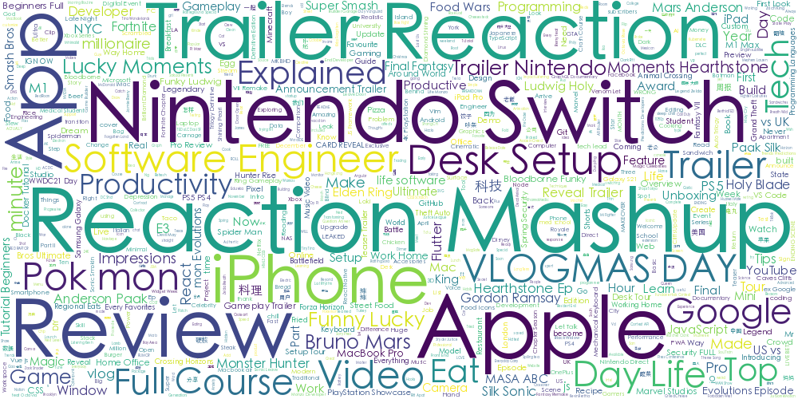
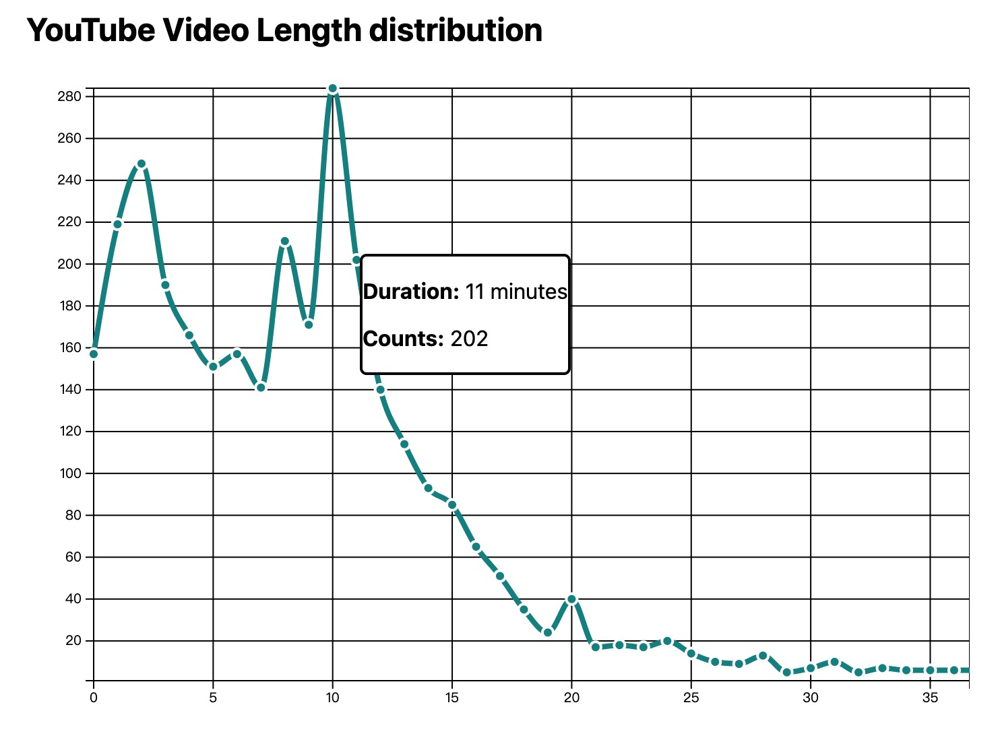

# YouTube-Data-Analysis

My YouTube watching history data analysis(mostly based on 2021)

#### Here are some visualization 👇

- matplotlib / wordcloud version:
  - 
  - 
  - 
- D3.js version:
  - 
  - 
  - 
